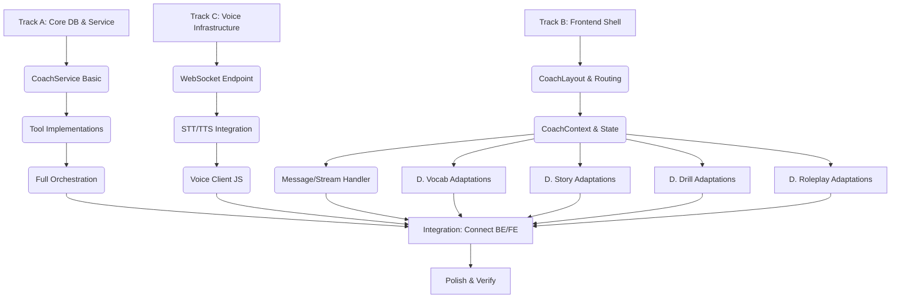

# Coach-Centric Architecture: Execution & Delegation Plan

**Date:** 2025-12-16
**Based on:** `docs/plans/2025-12-15-coach-centric-architecture-design.md`

## 1. Executive Summary

This document breaks down the "Coach-Centric" migration into **4 distinct work tracks**.
The goal is to maximize parallelism. Tracks A, B, and C can start simultaneously, while Track D (Components) depends partially on B (Frontend Shell) but can be highly parallelized once the shell is ready.

### 🏗️ Work Tracks

| Track | Focus | Team/Role | Dependencies |
|-------|-------|-----------|--------------|
| **A. Core Engine** | Backend, DB, Logic | Backend Engineer | None |
| **B. Interface Shell** | Frontend Layout, State | Frontend Architect | Minimal |
| **C. Voice Pipeline** | STT, TTS, WebSocket | AI/Systems Eng | None |
| **D. Teaching Tools** | UI Components (Porting) | Frontend Devs (Multiple) | Requires Track B |

---

## 2. Dependency Graph

---

## 3. Detailed Task Breakdown

### 🔴 Track A: The Core Brain (Backend)
*Owner: Backend Lead*
*Execution: Serial*

1.  **Database Migration** (`priority: critical`)
    *   Create `user_memories`, `user_progress`, `coach_sessions` tables.
    *   Update `User` model relationships.
2.  **CoachService Scaffold**
    *   Setup `app/services/coach.py` class structure.
    *   Implement `start_session(user_id)` to initialize conversation.
3.  **Tool Primitives** (Can be sub-delegated)
    *   Implement `remember()`, `recall()`, `get_profile()`.
    *   Refactor existing generators (`theme`, `story`) to be callable as tools.
4.  **LLM Integration**
    *   Connect `CoachService` to `DeepSeek` with `tools=[...]` definitions.
    *   Implement the `handle_turn` loop (User -> LLM -> Tool -> LLM -> Response).

### 🔵 Track B: The Body (Frontend Shell)
*Owner: Frontend Architect*
*Execution: Serial*

1.  **Router & Clean Slate**
    *   Create new route `/coach` (or replace root).
    *   Remove legacy Tab Navigation (Learn/Drill/Apply).
2.  **Layout Implementation**
    *   Build `CoachCanvas` (The 70% top area).
    *   Build `CoachFooter` (The 30% bottom area).
    *   Implement "Cyber-Noir" styling for these containers.
3.  **Global Coach State**
    *   Create `CoachContext` to manage:
        *   `messages` (Transcript)
        *   `activeTool` (What is showing in Canvas)
        *   `isListening` (Voice state)

### 🟢 Track C: The Senses (Voice Pipeline)
*Owner: Systems/AI Engineer*
*Execution: Parallel with A & B*

1.  **WebSocket Infrastructure**
    *   Create `app/routers/voice.py` WebSocket endpoint.
    *   Establish simple echo test.
2.  **TTS Integration (Mouth)**
    *   Implement `TextToSpeech` service (EdgeTTS or Google).
    *   Ensure binary audio data can be sent over WS.
3.  **STT Integration (Ears)**
    *   Implement `SpeechToText` service (Whisper API or similar).
    *   Handle incoming audio chunks.
4.  **Frontend Voice Controller**
    *   Create `VoiceController.js` to handle `MediaRecorder` and WS connection.
    *   Implement "Push to Talk" UI logic.

### 🟠 Track D: The Tools (Component Adaptation)
*Owner: Frontend Team (Scalable / Parallel)*
*Dependencies: Needs Track B (CoachContext)*

*These tasks can be distributed to different developers:*

*   **Task D.1: Vocabulary Adapter**
    *   Modify `VocabGrid` to accept `mode="coach-cards"`.
    *   Create simplified `VocabCard` component for distinct word teaching.
*   **Task D.2: Story Adapter**
    *   Update `StoryReader` to support auto-scrolling/highlighting controlled by props.
    *   Remove internal "Generate" buttons (Coach controls generation).
*   **Task D.3: Drill Adapter**
    *   Create `DrillSingle` component (Focus on one question at a time).
    *   Connect answer submission to `CoachContext.submitAnswer()`.
*   **Task D.4: Chat Adapter**
    *   Refactor `ChatCard` to be purely a UI renderer (remove internal state if possible, or sync with Coach).

---

## 4. Integration & Rollout Strategy

1.  **Milestone 1: The "Silent" Coach (Text Only)**
    *   Combine **Track A** + **Track B**.
    *   Result: Users can type to the coach, coach replies text, and triggers `show_vocabulary` (mocked) in the canvas.
    *   *Deliverable: Working Text-based Chat with UI Tool Switching.*

2.  **Milestone 2: The "Blind" Coach (Voice Added)**
    *   Merge **Track C**.
    *   Result: Users can speak to the coach.
    *   *Deliverable: "Hey Coach" functionality active.*

3.  **Milestone 3: Full Tool Power**
    *   Merge **Track D** components one by one.
    *   Enable the actual logic in Backend to call these tools.

4.  **Milestone 4: Migration**
    *   Switch default route.
    *   Update onboarding.
