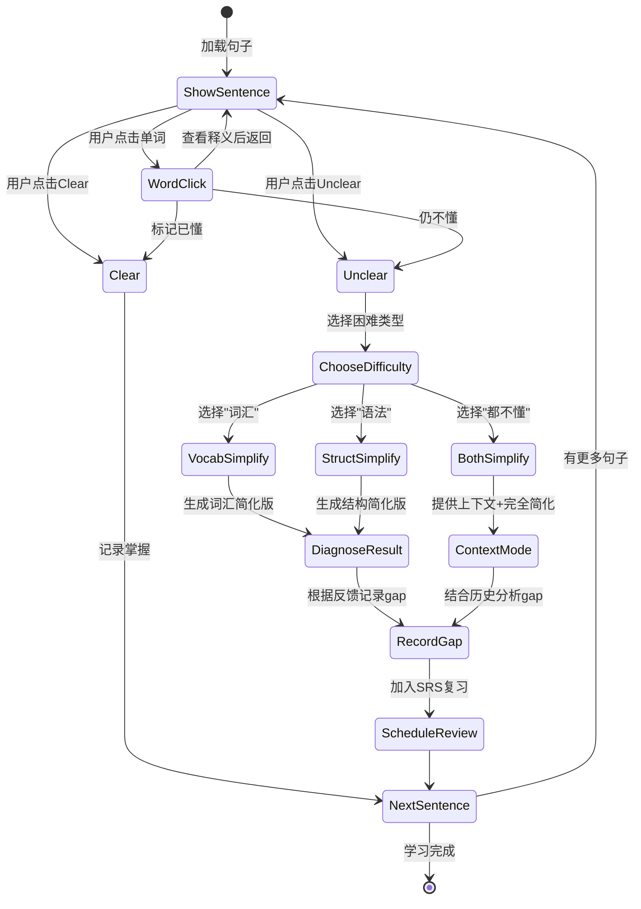

# Adaptive Sentence Learning (ASL) - 设计文档

> **核心理念**: 通过行为推断 + 诊断式简化，精准定位用户的理解障碍

---

## 1. 问题陈述

### 现状
- Reading Mode 呈现全文，用户被动浏览
- Calibration 只收集 clear/confused，信息维度单一
- 无法区分：词汇问题 vs 语法问题 vs 综合问题

### 目标
- 逐句学习，主动交互
- 隐式行为推断 + 显式诊断验证
- 构建多维用户画像，驱动个性化学习

---

## 2. 交互流程

```
┌─────────────────────────────────────────────────────────┐
│  Sentence Study Mode                      [Exit]        │
├─────────────────────────────────────────────────────────┤
│  Progress: ████████░░░░░░░░ 23/127                      │
├─────────────────────────────────────────────────────────┤
│                                                         │
│  "The unprecedented [surge] in renewable energy         │
│   investment has [catalyzed] a paradigm shift           │
│   in global markets."                                   │
│                                                         │
│  [highlighted words are clickable]                      │
│                                                         │
├─────────────────────────────────────────────────────────┤
│  ┌─────────┐  ┌─────────────┐  ┌─────────────┐         │
│  │ Clear ✓ │  │ Unclear ?   │  │ Next →      │         │
│  └─────────┘  └─────────────┘  └─────────────┘         │
└─────────────────────────────────────────────────────────┘
```

### 2.1 基本流程



### 2.2 诊断模式 (Diagnose Mode)

当用户点击 `Unclear` 时，先让用户选择困难类型：

```
┌─────────────────────────────────────────────────────────┐
│  What's making this sentence tricky?                    │
├─────────────────────────────────────────────────────────┤
│                                                         │
│  ┌─────────────────┐  ┌─────────────────┐              │
│  │ 📖 Vocabulary   │  │ 🔧 Grammar      │              │
│  │ Hard words      │  │ Sentence struct │              │
│  └─────────────────┘  └─────────────────┘              │
│                                                         │
│  ┌─────────────────────────────────────────┐           │
│  │ 🤷 Both / Not Sure                       │           │
│  │ I don't understand anything              │           │
│  └─────────────────────────────────────────┘           │
│                                                         │
└─────────────────────────────────────────────────────────┘
```

#### 2.2.1 选择"词汇" → 生成词汇简化版

```
┌─────────────────────────────────────────────────────────┐
│  Version with Simpler Words:                            │
├─────────────────────────────────────────────────────────┤
│                                                         │
│  "The big increase in clean energy investment           │
│   has caused a major change in world markets."          │
│                                                         │
│  ┌─────────────┐  ┌─────────────────┐                  │
│  │ Got it! ✓   │  │ Still Unclear 😕 │                 │
│  └─────────────┘  └─────────────────┘                  │
├─────────────────────────────────────────────────────────┤
│  → Got it: 确认词汇是障碍，记录词汇gap                  │
│  → Still Unclear: 可能还有结构问题，进入结构简化       │
└─────────────────────────────────────────────────────────┘
```

#### 2.2.2 选择"语法" → 生成结构简化版

```
┌─────────────────────────────────────────────────────────┐
│  Version with Simpler Structure:                        │
├─────────────────────────────────────────────────────────┤
│                                                         │
│  "Renewable energy investment increased a lot.          │
│   This changed global markets."                         │
│                                                         │
│  ┌─────────────┐  ┌─────────────────┐                  │
│  │ Got it! ✓   │  │ Still Unclear 😕 │                 │
│  └─────────────┘  └─────────────────┘                  │
├─────────────────────────────────────────────────────────┤
│  → Got it: 确认结构是障碍，记录语法pattern             │
│  → Still Unclear: 可能还有词汇问题，进入词汇简化       │
└─────────────────────────────────────────────────────────┘
```

#### 2.2.3 选择"都不懂" → 上下文模式

```
┌─────────────────────────────────────────────────────────┐
│  Let's break it down with context:                      │
├─────────────────────────────────────────────────────────┤
│  Previous: "Climate change has become a global          │
│            priority for governments worldwide."         │
│                                                         │
│  Current (simplified):                                  │
│  "Because of this, people are putting a lot of money    │
│   into clean energy. This is changing how the world     │
│   does business."                                       │
│                                                         │
│  Next: "Major corporations are now committing to        │
│        carbon neutrality by 2050."                      │
├─────────────────────────────────────────────────────────┤
│  Based on your history, you may struggle with:          │
│  • Complex noun phrases ("unprecedented surge")         │
│  • Causative verbs ("catalyzed")                       │
│                                                         │
│  ┌─────────────────────────────────┐                   │
│  │ I understand now ✓               │                   │
│  └─────────────────────────────────┘                   │
└─────────────────────────────────────────────────────────┘
```

---

## 3. 行为推断矩阵

| 行为组合 | 推断 | 置信度 | 后续动作 |
|---------|------|--------|---------|
| Clear，无点词 | 完全理解 | 高 | 记录掌握 |
| Clear，有点词 | 词汇补充后理解 | 高 | 记录词汇gap |
| Unclear → 词汇 → Got it | 词汇障碍 | 高 | 记录词汇gap + SRS |
| Unclear → 语法 → Got it | 结构障碍 | 高 | 记录语法pattern + SRS |
| Unclear → 词汇 → Still → 语法 → Got it | 混合问题 | 高 | 记录两种gap + SRS |
| Unclear → 都不懂 | 综合问题 | 中 | 上下文模式 + 历史分析 |
| 长停留 + Clear | 处理困难但理解 | 中 | 标记为边界能力 |

---

## 4. 简化生成策略

### 4.1 LLM Prompt Templates

**词汇简化**:
```
Rewrite this sentence using simpler vocabulary (COCA 0-3000), 
but keep the exact grammatical structure unchanged:
"{original_sentence}"
```

**结构简化**:
```
Break this sentence into 2-3 shorter, simpler sentences 
while keeping the same vocabulary words:
"{original_sentence}"
```

**上下文完全简化** (用于"都不懂"场景):
```
Given this sentence and its context, explain it in the simplest English (A1 level).
Also identify which vocabulary and grammar patterns might be causing difficulty
for a learner at COCA band {user_vocab_band} with these weak patterns: {weak_patterns}.

Previous sentence: "{prev_sentence}"
Current sentence: "{original_sentence}"
Next sentence: "{next_sentence}"

Respond in JSON:
{
  "simplified": "...",
  "likely_vocab_issues": ["word1", "word2"],
  "likely_grammar_issues": ["pattern1", "pattern2"]
}
```

### 4.2 简化层级

```
Level 0: 原句
Level 1: 词汇简化 OR 结构简化 (用户选择)
Level 2: 词汇+结构都简化 (Still Unclear时自动升级)
Level 3: 上下文模式 + 核心意思提取 (都不懂时)
```

---

## 5. 诊断算法

```python
def diagnose_comprehension(
    user_choice: str,  # "vocabulary", "grammar", "both"
    simplified_response: str,  # "got_it", "still_unclear"
    word_clicks: List[str],
    user_profile: UserComprehensionProfile
) -> DiagnosisResult:
    """
    根据用户选择和对简化版本的反馈，诊断理解障碍
    """
    
    if user_choice == "vocabulary":
        if simplified_response == "got_it":
            # 用户选词汇，简化后懂了 → 确认词汇问题
            return DiagnosisResult(
                gap_type="vocabulary",
                words=extract_difficult_words(original, word_clicks),
                confidence=0.9,
                needs_review=True
            )
        else:
            # 简化后还不懂 → 可能还有结构问题，让用户继续看结构简化版
            return DiagnosisResult(
                gap_type="vocabulary",
                continue_to="grammar",
                confidence=0.6
            )
    
    elif user_choice == "grammar":
        if simplified_response == "got_it":
            # 用户选语法，简化后懂了 → 确认结构问题
            return DiagnosisResult(
                gap_type="structure",
                pattern=detect_grammar_pattern(original),
                confidence=0.9,
                needs_review=True
            )
        else:
            # 简化后还不懂 → 可能还有词汇问题
            return DiagnosisResult(
                gap_type="structure",
                continue_to="vocabulary",
                confidence=0.6
            )
    
    else:  # "both"
        # 都不懂 → 上下文模式 + 结合历史分析
        historical_gaps = analyze_user_history(user_profile)
        return DiagnosisResult(
            gap_type="fundamental",
            likely_vocab_issues=historical_gaps.common_vocab_gaps,
            likely_grammar_issues=historical_gaps.common_structure_gaps,
            context_provided=True,
            needs_review=True,
            confidence=0.7
        )


def analyze_user_history(profile: UserComprehensionProfile) -> HistoricalAnalysis:
    """
    分析用户历史不懂的句子，找出规律
    """
    recent_unclear = get_recent_unclear_sentences(profile.user_id, limit=20)
    
    # 统计词汇gap频次
    vocab_gaps = Counter()
    for record in recent_unclear:
        vocab_gaps.update(record.word_clicks)
    
    # 统计语法pattern频次
    grammar_gaps = Counter()
    for record in recent_unclear:
        if record.diagnosed_gap_type == "structure":
            grammar_gaps.update(record.diagnosed_patterns)
    
    return HistoricalAnalysis(
        common_vocab_gaps=vocab_gaps.most_common(5),
        common_structure_gaps=grammar_gaps.most_common(3)
    )
```

---

## 6. 数据模型

### 6.1 句子学习记录

```python
class SentenceLearningRecord(Base):
    __tablename__ = "sentence_learning_records"
    
    id: int
    user_id: str
    
    # 句子定位 (不存储原文，按需获取)
    source_type: str          # epub, rss
    source_id: str
    sentence_index: int
    
    # 用户交互
    initial_response: str     # clear, unclear
    unclear_choice: str       # vocabulary, grammar, both (nullable)
    simplified_response: str  # got_it, still_unclear (nullable)
    word_clicks: List[str]    # 点击过的单词
    dwell_time_ms: int        # 停留时间
    
    # 最终诊断
    diagnosed_gap_type: str   # vocabulary, structure, fundamental
    diagnosed_patterns: List[str]
    confidence: float
    
    # SRS 复习
    scheduled_review: datetime  # 下次复习时间
    review_count: int           # 复习次数
    last_review_result: str     # clear, unclear
    
    created_at: datetime
    updated_at: datetime
```

### 6.2 用户理解画像

```python
class UserComprehensionProfile(Base):
    __tablename__ = "user_comprehension_profiles"
    
    id: int
    user_id: str
    
    # 词汇维度
    vocab_comfort_band: int       # COCA band用户舒适区
    vocab_gap_words: JSON         # 明确不懂的词
    
    # 结构维度
    structure_weak_patterns: JSON # 弱项语法模式
    structure_strong_patterns: JSON
    
    # 处理维度
    avg_processing_speed: float   # 每词秒数
    max_comfortable_length: int   # 最长舒适句子长度
    
    # 统计
    total_sentences_studied: int
    clear_rate: float             # Clear比率
    vocabulary_gap_count: int     # 词汇gap次数
    structure_gap_count: int      # 结构gap次数
    fundamental_gap_count: int    # 综合问题次数
    
    updated_at: datetime
```

---

## 7. 与现有系统整合

### 7.1 入口点

| 入口 | 说明 |
|------|------|
| Reading Mode | 新增 "Study This Article" 按钮 |
| Navigation | 新增 "Sentence Study" 模式入口 |
| Calibration 完成后 | 推荐进入 Sentence Study 模式 |

### 7.2 学习流程

1. 用户选择一篇文章 (epub/rss)
2. 系统按顺序呈现句子
3. 用户逐句学习，标记 Clear/Unclear
4. 进度保存，支持断点续学
5. 完成后显示学习报告

### 7.3 数据共享

- **词汇高亮**: ASL的词汇诊断 → 更新 COCA band 高亮范围
- **用户画像**: ASL的结构诊断 → 影响未来句子难度评估
- **Sweep功能**: ASL中Clear的词 → 自动标记mastered
- **SRS系统**: Unclear的句子 → 自动加入复习队列

---

## 8. 实现优先级

### Phase 1: MVP ✅ (2026-01-01 Completed)
- [x] 基本句子展示 + Clear/Unclear 交互
- [x] 困难类型选择 UI (词汇/语法/都不懂)
- [x] 词汇简化版本生成
- [x] 基本行为记录
- [x] 学习进度保存
- [x] **Article Overview**: 文章上下文概览 + 中文翻译 (NEW)

### Phase 2: 诊断增强
- [x] 结构简化版本生成
- [x] 上下文模式 (都不懂场景)
- [ ] 诊断算法完善
- [ ] 历史分析功能

### Phase 3: SRS + 个性化
- [ ] SRS复习调度
- [ ] 用户画像构建与更新
- [ ] 与Reading Mode整合
- [ ] 学习报告生成


---

## 9. 技术考量

### 9.1 LLM调用优化
- **按需生成**: 用户选择后才生成对应简化版本
- **流式输出**: 使用流式生成减少等待感
- **缓存策略**: 已生成的简化版本缓存，避免重复调用

### 9.2 性能
- 句子预加载 (当前 + 下2句的元数据)
- 进度本地缓存 + 定期同步

### 9.3 数据存储
- 只存句子索引引用，不存原文
- 需要时从 Content Provider 获取

---

## 10. 成功指标

| 指标 | 目标 | 测量方式 |
|------|------|---------|
| 学习完成率 | > 60% 开始的文章被完成 | 直接统计 |
| 每session句数 | 平均 > 15句 | 直接统计 |
| Clear比率 | 随使用增加而上升 | 趋势分析 |
| 诊断触发率 | 20-40% (太低=太简单，太高=太难) | 直接统计 |
| 复习通过率 | SRS复习时 Clear > 70% | 直接统计 |
